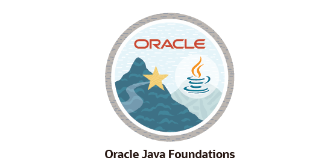

# Oracle Java Foundations ☕

## About

I successfully completed the **Oracle Java Foundations** learning path from **Oracle University** and passed the assessment with **85%**.

This course strengthened my understanding of Java programming fundamentals and object-oriented programming concepts.

---

## Skills Learned

- Java Fundamentals
- Variables and Data Types
- Operators
- Decision Making
- Loops
- Methods
- Arrays
- Classes and Objects
- Object-Oriented Programming (OOP)
- Exception Handling

---

## Technologies

- Java
- Oracle University

---

## Achievement

✔ Successfully completed Oracle Java Foundations

✔ Passed Assessment (85%)

---

## Badge

---

## Connect with Me

- LinkedIn: https://www.linkedin.com/in/kapa-srilakshmi-4a0602354/
- GitHub: https://github.com/kapasrilakshmi075
